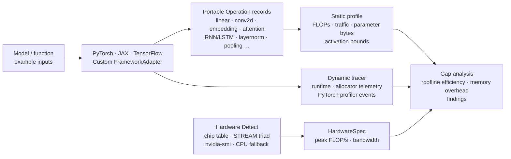

# neural-cost

[](https://pypi.org/project/neural-cost/)
[](https://pypi.org/project/neural-cost/)
[](https://github.com/davidgraymi/neural-cost/actions/workflows/ci.yml)
[](https://opensource.org/licenses/MIT)
[](https://pypi.org/project/neural-cost/)
[](https://github.com/astral-sh/ruff)

[**PyPI Package**](https://pypi.org/project/neural-cost/) • [**Documentation**](https://github.com/davidgraymi/neural-cost#readme) • [**Issue Tracker**](https://github.com/davidgraymi/neural-cost/issues) • [**Releases**](https://github.com/davidgraymi/neural-cost/releases)

`neural-cost` estimates a neural network's useful compute and compulsory tensor
traffic, measures its runtime, and uses a roofline lower bound to highlight
likely optimization opportunities.  It is intentionally framework-neutral at
its core: PyTorch, TensorFlow, and JAX are optional adapters rather than base
dependencies.

## Installation

Install the core package from [PyPI](https://pypi.org/project/neural-cost/):

```bash
pip install neural-cost
```

Or using [`uv`](https://docs.astral.sh/uv/):

```bash
uv add neural-cost
```

### Framework Adapters

Framework adapters are optional extras, keeping `neural-cost` lightweight with zero mandatory external dependencies:

| Framework | Installation Command | Description |
|---|---|---|
| **PyTorch** | `pip install "neural-cost[torch]"` | PyTorch eager execution & FX graph tracer adapter |
| **JAX** | `pip install "neural-cost[jax]"` | JAX primitives and jaxpr tracing |
| **JAX on Apple Silicon (Metal)** | `pip install "neural-cost[jax-metal]"` | Official Apple Metal plugin for JAX GPU acceleration |
| **JAX on Apple Silicon (MPS)** | `pip install "neural-cost[jax-mps]"` | Community MLX backend for Apple Silicon MPS |
| **TensorFlow** | `pip install "neural-cost[tensorflow]"` | TensorFlow / Keras layer adapter |
| **All Frameworks** | `pip install "neural-cost[torch,jax,tensorflow]"` | All supported deep learning framework adapters |
| **Development** | `pip install "neural-cost[dev]"` | Test suite (`pytest`) & code style tools (`ruff`) |

### Development & Source Installation

For local development or running benchmarks directly from the source repository:

```bash
git clone https://github.com/davidgraymi/neural-cost.git
cd neural-cost
pip install -e '.[dev,torch,jax,tensorflow]'
```

## Architecture



## Supported operation kinds

| Kind | Description |
|---|---|
| `linear` | Dense / fully-connected projection |
| `conv2d` | 2-D convolution (NCHW / OIHW) |
| `matmul` | Raw matrix multiply |
| `embedding` | Token embedding lookup (read-only traffic model) |
| `attention` | Multi-head self-attention (QKV projections + softmax + output) |
| `elementwise` | Point-wise ops (ReLU, exp, tanh, …) |
| `softmax` / `layernorm` / `batchnorm` | Normalisation ops |
| `rmsnorm` | Root Mean Square normalisation |
| `swiglu` | Gated linear unit with Swish activation |
| `pooling` | Max / average / global-average pooling |
| `moe` | Mixture-of-Experts sparse routing and expert FFN execution |
| `custom` | Caller-supplied explicit FLOP count |

Adapters automatically emit the right kind for each layer type:

| Framework | Captured layer types |
|---|---|
| **PyTorch** | `Linear`, `Conv2d`, `Embedding`, `RNN`, `GRU`, `LSTM`, `MultiheadAttention`, `LayerNorm`, `BatchNorm1d/2d` |
| **TensorFlow** | `Dense`, `Conv2D`, `Embedding`, `GRU`, `LSTM`, `MultiHeadAttention`, `BatchNormalization`, `LayerNormalization`, pooling layers |
| **JAX** | `dot_general` (matmul), `conv_general_dilated` (conv2d), common elementwise jaxpr primitives |

## Analyze portable operations

```python
from neural_cost import HardwareSpec, Operation, analyze_gap, benchmark, estimate_operations, detect_hardware

ops = [Operation("classifier", "linear", ((32, 768), (768, 1000)), (32, 1000), 2)]
estimate = estimate_operations(ops)
measurement = benchmark(lambda: run_inference(), warmup=5, repeats=20)

# Auto-detect or specify manually:
hardware, info = detect_hardware()
# Or: hardware = HardwareSpec("GPU", peak_flops=312e12, memory_bandwidth=1.6e12)
report = analyze_gap(estimate, measurement, hardware)

print(report.render())
```

The theoretical model reports FLOPs, tensor reads/writes, arithmetic intensity,
and a compute/bandwidth lower bound.  The measured gap is expected: it captures
launch overhead, synchronization, framework behavior, unfused intermediates,
workspaces, caches, and imperfect kernel utilization.

## Profile static memory and training state

`profile_model` combines FLOP/traffic estimation with parameter and activation
storage bounds.  For training, it also models a parameter-sized gradient buffer
and configurable optimizer state; use `optimizer_state_multiplier=2` for
Adam's two moment buffers.

```python
from neural_cost import profile_model
from neural_cost.adapters import TorchAdapter

profile = profile_model(
    model, inputs, TorchAdapter(), training=True, optimizer_state_multiplier=2
)
print(profile.memory.training_minimum_bytes)
```

The minimum activation bound is the largest output tensor.  The conservative
bound assumes all forward outputs remain live, so real allocator telemetry is
the source of truth for physical VRAM use.

## Mixture-of-Experts (MoE) & Speculative Decoding

`neural-cost` provides specialized theoretical models for modern LLM serving paradigms:

### MoE Sparse Routing & Memory Thrashing

Sparse MoE architectures (e.g. Mixtral, DeepSeek) activate only $k$ of $E$ experts per token. While compute scales with $k$, token-by-token autoregressive decoding requires loading unique experts from DRAM into registers/SRAM, producing severe memory-bandwidth pressure at small batch sizes:

```python
from neural_cost import estimate_moe, analyze_moe_gap, detect_hardware

# Mixtral 8x7B layer: 8 experts, top-2 routing, SwiGLU FFN
est = estimate_moe(
    batch_size=1,
    seq_len=1,
    embed_dim=4096,
    expert_hidden_dim=14336,
    num_experts=8,
    top_k=2,
    expert_type="swiglu",
    is_decode=True,
)

print(f"Total params: {est.total_parameters:,} | Active params: {est.active_parameters:,}")
print(f"Expected loaded experts at B=1: {est.expected_loaded_experts:.1f}")

hardware, _ = detect_hardware()
gap = analyze_moe_gap(est, hardware)
print(gap.render())
```

### Speculative Decoding Breakeven Analysis

Speculative decoding pairs a fast draft model with a parallel target model verification step. `neural-cost` computes the analytical breakeven acceptance rate ($\alpha^*$) required to achieve wall-clock speedup on target hardware:

```python
from neural_cost import (
    CostEstimate,
    detect_hardware,
    estimate_speculative_decoding,
    analyze_speculative_decoding,
)

hardware, _ = detect_hardware()

# Target (70B) vs Draft (1B) step costs
draft_decode = CostEstimate(flops=2e9, read_bytes=2e9, write_bytes=2048, operations=1)
target_verify = CostEstimate(flops=560e9, read_bytes=140e9, write_bytes=16384, operations=1)
target_decode = CostEstimate(flops=140e9, read_bytes=140e9, write_bytes=4096, operations=1)

analysis = analyze_speculative_decoding(
    draft_decode_cost=draft_decode,
    target_verify_cost=target_verify,
    target_decode_cost=target_decode,
    hardware=hardware,
    gamma=4,
    acceptance_rate=0.75,
)

print(analysis.render())
```

### PagedAttention & KV Cache Memory Modeling

PagedAttention (vLLM) allocates non-contiguous fixed-size blocks (e.g. 16 tokens) to eliminate external fragmentation and over-reservation. `neural-cost` models exact block allocation, compulsory vs wasted fragmentation bytes, prefix cache sharing, and concurrency capacity multipliers:

```python
from neural_cost import estimate_paged_attention, analyze_paged_attention_gap

# 32 concurrent requests with heterogeneous context lengths
context_lens = [256 + (i * 32) for i in range(32)]
paged_cost = estimate_paged_attention(
    batch_size=32,
    context_lens=context_lens,
    embed_dim=4096,
    num_heads=32,
    num_kv_heads=8,  # Grouped-Query Attention (GQA)
    block_size=16,
    num_layers=32,
    max_model_len=4096,
    shared_prefix_tokens=128,  # 128-token shared system prompt
)

gap = analyze_paged_attention_gap(paged_cost)
print(gap.render())
# Reports VRAM saved vs contiguous max reservation, fragmentation ratio, and concurrency gain
```

### Continuous Batching Iteration Cost Simulator

Modern serving engines (vLLM, TGI, TensorRT-LLM) use iteration-level scheduling (continuous/in-flight batching) mixing memory-bound autoregressive decodes and compute-heavy chunked prefills in the same step. `neural-cost` simulates the unified arithmetic intensity and lower-bound execution time across model weights and KV caches:

```python
from neural_cost import (
    estimate_continuous_batch_iteration,
    analyze_continuous_batch_iteration,
    detect_hardware,
)

hardware, _ = detect_hardware()

# Mixed iteration: 64 decode streams + one 512-token chunked prefill
iteration = estimate_continuous_batch_iteration(
    decode_context_lens=[1024] * 64,
    prefill_chunk_lens=[512],
    embed_dim=4096,
    num_heads=32,
    num_kv_heads=8,
    num_layers=32,
    hardware=hardware,
)

gap = analyze_continuous_batch_iteration(iteration, hardware)
print(gap.render())
# Identifies compute vs memory bottleneck and optimal prefill chunk sizing to reach the roofline ridge
```

### State Space Models (Mamba / S6 / SSD) & Linear Attention

State Space Models replace the quadratic $O(L^2)$ attention mechanism and linear-growth $O(L)$ KV cache with a fixed-size $O(1)$ hidden recurrent state ($h_t \in \mathbb{R}^{B \times D_{\text{in}} \times N}$).

`neural-cost` models the associative parallel scan in prefill and constant-memory recurrent step in decode:

```python
from neural_cost import analyze_ssm_gap, detect_hardware, estimate_ssm

# Mamba-3B layer: hidden dim 4096, state dim 16, expand factor 2
est = estimate_ssm(
    batch_size=1,
    seq_len=8192,
    embed_dim=4096,
    state_dim=16,
    expand_factor=2,
    conv_kernel_size=4,
    num_layers=32,
    is_decode=True,
)

print(f"Recurrent state footprint: {est.state_bytes / 1e6:.2f} MB (constant O(1) in seq_len)")
print(
    f"KV cache eliminated: {est.memory_savings_ratio_vs_transformer:.1%} savings vs Transformer KV"
)

hardware, _ = detect_hardware()
gap = analyze_ssm_gap(est, hardware)
print(gap.render())
# Reports constant-memory decode lower bound and throughput advantage over Transformer KV cache retrieval
```

### Distributed 3D Parallelism & Interconnect Rooflines (v0.8.0)

When scaling large models across multi-node clusters, training throughput is governed by the interaction between compute rooflines, network interconnect fabrics, and 3D parallelism strategy.

`neural-cost` models **Tensor Parallelism (TP)**, **Pipeline Parallelism (PP)**, and **Data Parallelism / ZeRO / FSDP** communication volumes, Hockney ($\alpha$-$\beta$) network transfer times, 1F1B schedule bubble fractions, and per-device memory sharding:

```python
from neural_cost import (
    ClusterTopology,
    HardwareSpec,
    analyze_distributed_gap,
    estimate_parallelism,
    get_interconnect_preset,
)

# 128x H100 cluster across 16 nodes (8 GPUs per node)
h100 = HardwareSpec(
    "H100", peak_flops=989e12, memory_bandwidth=3.35e12, memory_capacity=80 * 1024**3
)
topo = ClusterTopology(
    device=h100,
    num_nodes=16,
    devices_per_node=8,
    intra_node=get_interconnect_preset("nvlink4"),  # 900 GB/s
    inter_node=get_interconnect_preset("infiniband_ndr"),  # 50 GB/s
)

# Train Llama-3 70B with TP=8, PP=4, DP=4 (ZeRO-3 / FSDP)
cost = estimate_parallelism(
    total_parameters=70_000_000_000,
    batch_size=128,
    seq_len=4096,
    embed_dim=8192,
    num_layers=80,
    tp_degree=8,
    pp_degree=4,
    dp_degree=4,
    num_microbatches=8,
    dp_mode="zero3_fsdp",
)

gap = analyze_distributed_gap(cost, topo, overlap_efficiency=0.85)
print(gap.render())
# Reports MFU, step time, communication overhead, pipeline bubble fraction, and memory fit
```

## Hardware detection

Auto-detection via `detect_hardware()` returns a `(HardwareSpec, DetectionResult)` tuple
to determine hardware peak compute and memory bandwidth:

- **Apple Silicon lookup from chip table**: Identifies Apple Silicon chips (M1–M4 series) and looks up published peak FP32 throughput and memory bandwidth.
- **NumPy STREAM-triad bandwidth benchmark**: Measures live effective memory bandwidth using a STREAM Triad kernel (`c = a + scalar * b`).
- **NVIDIA GPU probe via nvidia-smi**: Probes GPU models, clock rates, and bus specs on systems with NVIDIA GPUs.
- **CPU fallback**: Falls back to CPU logical core counts and clock rates when accelerator probes are unavailable.

```python
from neural_cost import detect_hardware

hardware, info = detect_hardware()
print(f"Device: {hardware.device_name} ({info.source})")
print(f"Peak FLOP/s: {hardware.peak_flops / 1e12:.1f} TFLOP/s")
print(f"Bandwidth: {hardware.memory_bandwidth / 1e9:.1f} GB/s")
```

## Framework adapters

```python
import torch
from neural_cost import estimate_model
from neural_cost.adapters import TorchAdapter

model = torch.nn.Sequential(torch.nn.Linear(128, 64), torch.nn.ReLU(), torch.nn.Linear(64, 10))
inputs = (torch.randn(16, 128),)
estimate = estimate_model(model, inputs, TorchAdapter())
measurement = TorchAdapter().benchmark(model, *inputs)
```

`TorchAdapter` captures `Linear`, `Conv2d`, `Embedding`, `RNN`, `GRU`, `LSTM`,
`MultiheadAttention`, `LayerNorm`, and `BatchNorm` modules via forward hooks and
synchronizes CUDA benchmarks.  Its `trace` method uses `torch.profiler` and
returns aggregate profiler-event and CUDA allocator statistics.
`TensorFlowAdapter` captures the equivalent Keras layers and returns supported
TensorFlow GPU allocator statistics.  `JaxAdapter` traces conventional
`dot_general`, `conv_general_dilated`, and common elementwise jaxpr primitives
and waits for asynchronous device work during benchmarks.  All adapters are
optional imports:

```python
from neural_cost.adapters import JaxAdapter, TensorFlowAdapter, TorchAdapter
```

## E2E architecture comparison

Run the architecture comparison script to benchmark five canonical neural
network families side-by-side across all installed frameworks:

```bash
pip install "neural-cost[torch,jax,tensorflow]"
# Or from local editable checkout:
# pip install -e '.[torch,jax,tensorflow]'
python examples/architecture_comparison.py
```

The script evaluates **FF DNN**, **CNN**, **RNN**, **LSTM**, and **Transformer**
architectures using a shared hidden dimension (128) and batch size (16).
Hardware is auto-detected; pass `--peak-flops` / `--memory-bandwidth` to override.

## GPU benchmark

Run the GPU benchmark to evaluate the same five architectures on available GPU
accelerators (CUDA, ROCm, MPS, or CPU fallback):

```bash
# Auto-detect GPU (CUDA → MPS → CPU fallback)
python benchmarks/collect_gpu_data.py

# Quick run (fewer batch sizes / repeats)
python benchmarks/collect_gpu_data.py --quick

# Explicit CUDA device
python benchmarks/collect_gpu_data.py --device cuda

# Apple Silicon GPU
python benchmarks/collect_gpu_data.py --device mps

# Override hardware specs (e.g. NVIDIA A100 80 GB)
python benchmarks/collect_gpu_data.py \
  --peak-flops 312e12 --memory-bandwidth 2.0e12
```

Results are written to `benchmarks/results/benchmark_gpu_data.json`.
Generate figures and the full markdown report:

```bash
python benchmarks/generate_gpu_report.py
# → GPU_BENCHMARK_REPORT.md + benchmarks/results/figures/gpu_fig*.png
```

### GPU-vs-CPU crossover analysis

Find the exact batch size at which each architecture first runs faster on GPU than CPU:

```bash
# Collect CPU baseline first (if not already done)
python benchmarks/collect_data.py

# Run GPU benchmark with the fine batch-size grid (1, 4, 8 … 1024)
python benchmarks/collect_gpu_data.py --crossover

# Regenerate report — Figure GPU-8 (crossover plot) will now be included
python benchmarks/generate_gpu_report.py
```

The crossover analysis sweeps `CROSSOVER_BATCH_SIZES = [1, 4, 8, 16, 32, 64, 128, 256, 512, 1024]`
and prints a table showing the first batch at which GPU latency drops below CPU latency.

### JAX on Apple Silicon (MPS / Metal)

JAX requires an explicit GPU plugin to run on Apple Silicon GPUs.
**Without a plugin, JAX silently falls back to CPU** even on MPS-capable machines.
Install one of:

```bash
# Official Apple plugin via package extra:
pip install "neural-cost[jax-metal]"
# or directly:
pip install jax-metal

# Community MLX backend via package extra (set JAX_PLATFORMS=mps):
pip install "neural-cost[jax-mps]"
# or directly:
pip install jax-mps && JAX_PLATFORMS=mps python benchmarks/collect_gpu_data.py
```

The benchmark now detects whether a plugin is installed and emits a clear diagnostic
when JAX is running on CPU instead of the GPU.

Known JAX MPS limitations (tracked upstream):
- `jax.jit()` **regresses CNN latency 3×** on MPS — XLA's Metal conv lowering inserts
  extra memory-layout transposes for statically-shaped graphs (known bug).
- `jax.jit()` gains are large for LSTM (+1.79×) and Transformer (+1.12×) where XLA
  eliminates intermediate tensor roundtrips.

### GPU vs CPU benchmark differences

| Aspect | CPU benchmark | GPU benchmark |
|---|---|---|
| Timing | `time.perf_counter_ns` | CUDA events (`torch.cuda.Event`) |
| Sync barrier | None (CPU executes synchronously) | `torch.cuda.synchronize()` / `block_until_ready()` |
| TF optimised variant | `tf.function` (no XLA) | `tf.function(jit_compile=True)` (XLA GPU) |
| Batch sizes | 1, 8, 32, 128 | 8, 32, 128, 512 |
| Device placement | CPU tensors | `.to(device)` / `jax.device_put` / `tf.device` |

<details>
<summary>Sample output (Apple M3, 3.6 TFLOP/s · 100 GB/s, batch=16, seq=32)</summary>

```
┌─ Hardware ──────────────────────────────────────────────────────────────────
│  Device          : Apple M3
│  Peak FP32       : 3.60 TFLOP/s
│  Peak bandwidth  : 100.0 GB/s  (STREAM triad: 48.6 GB/s)
│  Ridge point     : 36.0 FLOP/byte
│  Detection source: Apple Silicon table (Apple M3) + NumPy STREAM triad
└────────────────────────────────────────────────────────────────────────────

━━━━━━━━━━━━━━━━━━━━━━━━━━━━━━━━━━━━━━━━━━━━━━━━━━━━━━━━━━━━━━━━━━━━━━━━━━━━━━━━━━━━━━━━━━━━━━━━━━━━━━━━━━━━━━━━━━━━━━━━━━━━━━━━━━━━━━━
  FF DNN   (784→128→128→10, LayerNorm)
━━━━━━━━━━━━━━━━━━━━━━━━━━━━━━━━━━━━━━━━━━━━━━━━━━━━━━━━━━━━━━━━━━━━━━━━━━━━━━━━━━━━━━━━━━━━━━━━━━━━━━━━━━━━━━━━━━━━━━━━━━━━━━━━━━━━━━━
Framework         FLOPs     Params    I/O MB      AI   ms(med)     ±ms   effic.       roofline         GFLOP/s     GB/s bound
───────────────────────────────────────────────────────────────────────────────────────────────────────────────────────────────────────
PyTorch            3.8M    475,176       0.6    6.45     0.089   0.059     6.6% [█░░░░░░░░░░░░░░░░░]     42.44     6.58 memory
JAX                3.8M    472,064       0.6    6.43     0.068   0.006     8.6% [██░░░░░░░░░░░░░░░░]     55.26     8.60 memory
TensorFlow         3.8M    475,176       0.6    6.45     1.844   0.124     0.3% [░░░░░░░░░░░░░░░░░░]      2.06     0.32 memory

━━━━━━━━━━━━━━━━━━━━━━━━━━━━━━━━━━━━━━━━━━━━━━━━━━━━━━━━━━━━━━━━━━━━━━━━━━━━━━━━━━━━━━━━━━━━━━━━━━━━━━━━━━━━━━━━━━━━━━━━━━━━━━━━━━━━━━━
  CNN   (3-ch input → Conv64 → Conv128 → GAP → Dense10, 32×32)
━━━━━━━━━━━━━━━━━━━━━━━━━━━━━━━━━━━━━━━━━━━━━━━━━━━━━━━━━━━━━━━━━━━━━━━━━━━━━━━━━━━━━━━━━━━━━━━━━━━━━━━━━━━━━━━━━━━━━━━━━━━━━━━━━━━━━━━
Framework         FLOPs     Params    I/O MB      AI   ms(med)     ±ms   effic.       roofline         GFLOP/s     GB/s bound
───────────────────────────────────────────────────────────────────────────────────────────────────────────────────────────────────────
PyTorch          668.5M    309,288      20.4   32.71     5.046   0.393     4.0% [█░░░░░░░░░░░░░░░░░]    132.48     4.05 memory
JAX              662.2M    306,944      25.7   25.78     2.406   0.202    10.7% [██░░░░░░░░░░░░░░░░]    275.27    10.68 memory
TensorFlow       670.1M    310,824      27.8   24.12     5.226   0.377     5.3% [█░░░░░░░░░░░░░░░░░]    128.23     5.32 memory

━━━━━━━━━━━━━━━━━━━━━━━━━━━━━━━━━━━━━━━━━━━━━━━━━━━━━━━━━━━━━━━━━━━━━━━━━━━━━━━━━━━━━━━━━━━━━━━━━━━━━━━━━━━━━━━━━━━━━━━━━━━━━━━━━━━━━━━
  RNN   (2-layer Vanilla RNN, hidden=128, seq=32)
━━━━━━━━━━━━━━━━━━━━━━━━━━━━━━━━━━━━━━━━━━━━━━━━━━━━━━━━━━━━━━━━━━━━━━━━━━━━━━━━━━━━━━━━━━━━━━━━━━━━━━━━━━━━━━━━━━━━━━━━━━━━━━━━━━━━━━━
Framework         FLOPs     Params    I/O MB      AI   ms(med)     ±ms   effic.       roofline         GFLOP/s     GB/s bound
───────────────────────────────────────────────────────────────────────────────────────────────────────────────────────────────────────
PyTorch           67.1M    267,304       2.4   28.29     1.019   0.176     2.3% [░░░░░░░░░░░░░░░░░░]     65.89     2.33 memory
JAX               33.7M    136,192       6.6    5.14     1.678   0.031     3.9% [█░░░░░░░░░░░░░░░░░]     20.10     3.91 memory
TensorFlow       201.4M    797,736       5.0   40.32    71.243   6.103     0.1% [░░░░░░░░░░░░░░░░░░]      2.83     0.07 compute

━━━━━━━━━━━━━━━━━━━━━━━━━━━━━━━━━━━━━━━━━━━━━━━━━━━━━━━━━━━━━━━━━━━━━━━━━━━━━━━━━━━━━━━━━━━━━━━━━━━━━━━━━━━━━━━━━━━━━━━━━━━━━━━━━━━━━━━
  LSTM   (2-layer LSTM, hidden=128, seq=32)
━━━━━━━━━━━━━━━━━━━━━━━━━━━━━━━━━━━━━━━━━━━━━━━━━━━━━━━━━━━━━━━━━━━━━━━━━━━━━━━━━━━━━━━━━━━━━━━━━━━━━━━━━━━━━━━━━━━━━━━━━━━━━━━━━━━━━━━
Framework         FLOPs     Params    I/O MB      AI   ms(med)     ±ms   effic.       roofline         GFLOP/s     GB/s bound
───────────────────────────────────────────────────────────────────────────────────────────────────────────────────────────────────────
PyTorch          268.5M       1.1M       6.3   42.58     2.856   0.091     2.6% [░░░░░░░░░░░░░░░░░░]     94.00     2.21 compute
JAX              135.5M    529,408      31.5    4.31     4.426   0.134     7.1% [█░░░░░░░░░░░░░░░░░]     30.61     7.11 memory
TensorFlow       268.5M       1.1M       6.3   42.58    43.502   1.862     0.2% [░░░░░░░░░░░░░░░░░░]      6.17     0.14 compute

━━━━━━━━━━━━━━━━━━━━━━━━━━━━━━━━━━━━━━━━━━━━━━━━━━━━━━━━━━━━━━━━━━━━━━━━━━━━━━━━━━━━━━━━━━━━━━━━━━━━━━━━━━━━━━━━━━━━━━━━━━━━━━━━━━━━━━━
  Transformer   (2-layer encoder, embed=128, heads=4, FFN×4, seq=32)
━━━━━━━━━━━━━━━━━━━━━━━━━━━━━━━━━━━━━━━━━━━━━━━━━━━━━━━━━━━━━━━━━━━━━━━━━━━━━━━━━━━━━━━━━━━━━━━━━━━━━━━━━━━━━━━━━━━━━━━━━━━━━━━━━━━━━━━
Framework         FLOPs     Params    I/O MB      AI   ms(med)     ±ms   effic.       roofline         GFLOP/s     GB/s bound
───────────────────────────────────────────────────────────────────────────────────────────────────────────────────────────────────────
PyTorch          421.4M       1.5M       9.5   44.59     1.551   0.211     7.5% [█░░░░░░░░░░░░░░░░░]    271.69     6.09 compute
JAX              201.9M    791,552      10.3   19.57     1.206   0.032     8.6% [██░░░░░░░░░░░░░░░░]    167.38     8.55 memory
TensorFlow       421.4M       1.6M       9.5   44.59    12.630   0.182     0.9% [░░░░░░░░░░░░░░░░░░]     33.37     0.75 compute

━━━━━━━━━━━━━━━━━━━━━━━━━━━━━━━━━━━━━━━━━━━━━━━━━━━━━━━━━━━━━━━━━━━━━━━━━━━━━━━━━━━━━━━━━━━━━━━━━━━━━━━━━━━━━━━━━━━━━━━━━━━━━━━━━━━━━━━
  Per-Architecture × Per-Framework Summary
━━━━━━━━━━━━━━━━━━━━━━━━━━━━━━━━━━━━━━━━━━━━━━━━━━━━━━━━━━━━━━━━━━━━━━━━━━━━━━━━━━━━━━━━━━━━━━━━━━━━━━━━━━━━━━━━━━━━━━━━━━━━━━━━━━━━━━━
  Architecture    PyTorch                       JAX                           TensorFlow
  ────────────────────────────────────────────────────────────────────────────────────────────────────────
  FF DNN           7.7% eff   0.08ms   3.8M FLOPs   10.0% eff   0.06ms   3.8M FLOPs    0.3% eff   1.98ms   3.8M FLOPs
  CNN              3.9% eff   5.29ms 668.5M FLOPs   11.3% eff   2.28ms 662.2M FLOPs    5.1% eff   5.41ms 670.1M FLOPs
  RNN              2.3% eff   1.02ms  67.1M FLOPs    3.9% eff   1.68ms  33.7M FLOPs    0.1% eff  71.24ms 201.4M FLOPs
  LSTM             2.6% eff   2.86ms 268.5M FLOPs    7.1% eff   4.43ms 135.5M FLOPs    0.2% eff  43.50ms 268.5M FLOPs
  Transformer      7.5% eff   1.55ms 421.4M FLOPs    8.6% eff   1.21ms 201.9M FLOPs    0.9% eff  12.63ms 421.4M FLOPs
```

> **Reading the table**
> All architectures are memory-bound on this CPU (AI < ridge point of 36 FLOP/byte).
> Low roofline efficiency across all frameworks reflects framework dispatch overhead
> and small-batch latency — the expected regime for CPU inference.
> JAX's eager XLA compilation delivers the most consistent efficiency across architectures.
> TensorFlow's eager Python dispatch overhead dominates at small batch sizes,
> especially for sequential (RNN/LSTM) workloads.

</details>

## Matrix-multiply workload comparison (original)

For a quick cross-framework sanity check on plain matmul shapes, run:

```bash
pip install "neural-cost[torch,jax,tensorflow]"
# Or from local editable checkout:
# pip install -e '.[torch,jax,tensorflow]'
python examples/compare_frameworks.py
```

Optional overrides with known hardware specs:

```bash
python examples/compare_frameworks.py --peak-flops 312e12 --memory-bandwidth 1.6e12
```

## Custom frameworks

Subclass `FrameworkAdapter` and implement `operations(model, example_inputs)`
to return portable `Operation` records.  The adapter can also override
`benchmark` to synchronize an accelerator or collect framework-specific memory
statistics.  This contract keeps model extraction separate from the framework-
independent estimator and analyzer.

## CLI Suite

`neural-cost` provides a unified command-line suite for hardware detection, theoretical profiling, empirical benchmarking, LLM serving analysis, and CI/CD budget assertions:

```bash
# General help and subcommands:
neural-cost --help
```

### 1. Hardware Detection & STREAM Benchmark

Probe attached accelerators, lookup Apple Silicon / NVIDIA published specs, and measure live NumPy STREAM memory bandwidth:

```bash
# Live probe with memory bandwidth benchmark:
neural-cost hardware

# Instant detection without STREAM benchmark:
neural-cost hardware --no-bench

# Machine-readable JSON output:
neural-cost hardware --json
```

### 2. Static Architecture Profiling

Compute forward FLOPs, parameter counts, KV cache size, activation memory, arithmetic intensity, and theoretical latency floor on detected or target hardware:

```bash
# Profile a 7B Transformer (Llama-style) at batch size 8:
neural-cost profile --arch transformer --batch-size 8 --seq-len 4096 --embed-dim 4096 --num-heads 32 --num-kv-heads 8 --num-layers 32 --dtype fp16

# Profile a quantized 70B Transformer with W4A16 AWQ and launch floor:
neural-cost profile --arch transformer --num-layers 80 --embed-dim 8192 --num-heads 64 --quantization w4a16_awq --num-kernels 640

# Profile an 8x7B Mixture-of-Experts layer:
neural-cost profile --arch moe --num-experts 8 --top-k 2 --embed-dim 4096 --expert-hidden-dim 14336 --decode

# Profile PagedAttention KV cache with shared prefix caching:
neural-cost profile --arch paged-attention --batch-size 32 --seq-len 2048 --block-size 16 --shared-prefix-tokens 128

# Profile State Space Model (Mamba) recurrent state and constant memory:
neural-cost profile --arch ssm --batch-size 1 --seq-len 4096 --embed-dim 4096 --num-layers 32
```

### 3. Empirical Benchmarking

Benchmark real execution latency, achieved compute throughput (GFLOP/s), achieved DRAM bandwidth (GB/s), and roofline efficiency on your local machine:

```bash
# Microbenchmark matrix multiplication:
neural-cost benchmark --arch linear --batch-size 64 --in-features 1024 --out-features 1024

# Benchmark MoE decode step:
neural-cost benchmark --arch moe --batch-size 1 --num-experts 8 --top-k 2

# Benchmark PagedAttention kernel:
neural-cost benchmark --arch paged-attention --batch-size 32 --seq-len 1024 --block-size 16

# Benchmark live NumPy STREAM memory bandwidth:
neural-cost benchmark --arch stream
```

### 4. CI Budget Gate (`audit`)

Enforce automated performance budgets and VRAM ceilings in your CI/CD pipelines. Exits with status `0` if all assertions pass, or `1` if any budget is exceeded:

```bash
# Fail CI if model exceeds 16GB VRAM or 50ms latency floor:
neural-cost audit \
    --arch transformer \
    --batch-size 1 \
    --seq-len 2048 \
    --embed-dim 4096 \
    --num-heads 32 \
    --num-layers 32 \
    --max-vram 16GB \
    --max-latency-ms 50.0

# JSON output for CI pipeline reporting:
neural-cost audit --arch mlp --in-features 1024 --out-features 1024 --max-vram 1GB --json
```

### 5. Modern LLM Serving Primitives (`llm`)

Dedicated analytical calculators for production serving architectures:

```bash
# Mixture-of-Experts routing & memory traffic:
neural-cost llm moe --batch-size 1 --num-experts 8 --top-k 2 --decode

# Speculative decoding analytical breakeven solver:
neural-cost llm speculative --gamma 4 --acceptance-rate 0.75

# PagedAttention KV cache capacity and fragmentation:
neural-cost llm paged --batch-size 32 --context-len 2048 --block-size 16

# Continuous batching mixed iteration cost simulator:
neural-cost llm continuous --decode-streams 64 --prefill-tokens 512

# State Space Model (Mamba/S6/SSD) recurrent cost and KV elimination analyzer:
neural-cost llm ssm --batch-size 1 --seq-len 32768 --embed-dim 4096 --num-layers 32 --decode

# Sub-byte quantization and dequantization ALU unpacking tax (AWQ, GPTQ, FP8, NVFP4):
neural-cost llm quant --batch-size 1 --in-features 4096 --out-features 4096 --quantization w4a16_awq

# Kernel launch floor & CUDA Graph / torch.compile speedup analyzer:
neural-cost llm launch-floor --num-kernels 640 --arithmetic-floor-ms 0.5 --launch-overhead-us 5.0 --measured-latency-ms 3.5
```

### 6. Multi-Framework Comparison (`compare`)

Run head-to-head empirical benchmarks across PyTorch, JAX, and TensorFlow (backward-compatible with `neural-cost-compare`):

```bash
# Multi-framework benchmark runner:
neural-cost compare
# Or using the legacy binary:
neural-cost-compare --warmup 10 --repeats 30
```

### 7. Distributed Cluster & 3D Parallelism (`distributed`)

Model cluster scaling efficiency, network communication volume, and MFU for frontier models:

```bash
# Model Llama-3 70B training across 16 nodes of 8x H100 with TP=8, PP=4, DP=4:
neural-cost distributed \
    --parameters 70e9 \
    --batch-size 128 \
    --seq-len 4096 \
    --embed-dim 8192 \
    --num-layers 80 \
    --num-nodes 16 \
    --devices-per-node 8 \
    --tp 8 \
    --pp 4 \
    --dp 4 \
    --microbatches 8 \
    --dp-mode zero3_fsdp \
    --intra-node nvlink4 \
    --inter-node infiniband_ndr

# Output cluster performance and communication breakdown as JSON:
neural-cost distributed --parameters 7e9 --batch-size 32 --tp 2 --dp 4 --json
```

## Current scope

The package profiles concrete-shape dense, matrix-multiply, convolution,
embedding lookup, multi-head attention, and common elementwise inference graphs,
alongside `softmax`, `layernorm`, `batchnorm`, and `pooling`.  Recurrent layers
(RNN, GRU, LSTM) are modelled as their constituent input→hidden and
hidden→hidden linear projections.  Static training storage includes gradients
and optimizer state but does not yet trace a full backward graph.  Activation
checkpointing, distributed communication, dynamic shapes, fusion details,
complete graph coverage, and non-PyTorch kernel-level traces remain deliberate
next increments rather than silently approximated.

## Development

Format and lint the codebase with a single command:

```bash
# Auto-format and fix linting in place:
python scripts/format.py
# Or using the shell wrapper:
./scripts/format.sh
# Or via Make:
make format

# Check formatting and linting without modifying files:
python scripts/format.py --check
# Or:
make check
```

## Automated Semantic Versioning & Release Pipeline

`neural-cost` uses an automated semantic versioning and release pipeline in GitHub Actions (`.github/workflows/ci.yml` and `.github/workflows/publish.yml`) powered by [`paulhatch/semantic-version`](https://github.com/paulhatch/semantic-version) with path filtering and PyPI trusted publishing.

Version upgrades are determined strictly by Conventional Commits that modify files in the distributed library (`src/`, `pyproject.toml`):

| Change Kind | Commit Conventional Type | Affects Library (`src/`)? | Version Increment | Release Action |
|---|---|---|---|---|
| **Breaking change** | `feat!:`, `fix!:`, `BREAKING CHANGE:` | ✅ Yes | **Major** (`X.0.0`) | Create tag & publish PyPI release |
| **New feature** | `feat:`, `feat(scope):` | ✅ Yes | **Minor** (`0.X.0`) | Create tag & publish PyPI release |
| **Bug fix / performance** | `fix:`, `perf:`, `refactor:` | ✅ Yes | **Patch** (`0.0.X`) | Create tag & publish PyPI release |
| **Non-library changes** | `docs:`, `chore:`, `ci:`, `test:`, benchmarks, workflows | ❌ No | **None** (unchanged) | No tag created; PyPI publish skipped |
| **Doc updates to library** | `docs:`, `style:` (docstrings only) | ✅ Yes | **None** (unchanged) | No tag created; PyPI publish skipped |

- **In CI (PRs)**: The `semver-check` workflow job automatically analyzes commits and library paths in the PR and prints a summary indicating whether a version bump is required and what the new version will be.
- **On Push to `main`**: The `publish` workflow triggers on changes to `src/**` or `pyproject.toml`. If a version increment is detected, it automatically creates and pushes the git tag, generates the GitHub Release, builds sdist & wheel, and publishes to PyPI.


